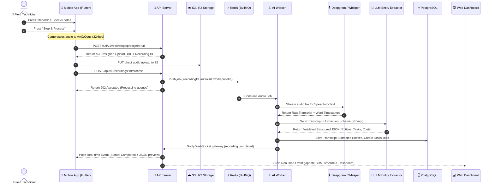

# System Architecture Document
## EchoDesk — AI Voice Agent & Field Operations CRM

**Document Version:** 1.0.0  
**Architect:** EchoDesk Core Engineering Team  

---

## 1. High-Level Architecture Overview

EchoDesk utilizes an **event-driven, asynchronous ingestion architecture** capable of handling high-volume audio uploads, real-time transcription, and resilient LLM extraction workflows.

```mermaid
flowchart TD
    subgraph Clients["Client Applications"]
        Mobile["📱 Flutter Mobile App<br/>(Clean Architecture, Riverpod, Offline Vault)"]
        Web["💻 React 19 Web Dashboard<br/>(TanStack Query, Tailwind v4, Wavesurfer.js)"]
    end

    subgraph Gateway["API Gateway & Real-Time Layer"]
        Nginx["Load Balancer / Reverse Proxy"]
        API["Node.js + Express 5 API Server<br/>(Zod, JWT Auth, RBAC)"]
        SocketServer["Socket.IO Server<br/>(Real-time Transcription & Processing Events)"]
    end

    subgraph Async_Queue["Asynchronous Worker Pipeline"]
        Redis["Redis (BullMQ Message Broker)"]
        Worker["Audio & AI Processing Worker<br/>(Transcribe ➔ Extract ➔ Format)"]
    end

    subgraph External_AI["AI Services"]
        STT["🎙️ Speech-to-Text API<br/>(Deepgram Nova-2 / Whisper API)"]
        LLM["🧠 Structured LLM Engine<br/>(Claude 3.5 Sonnet / GPT-4o / Gemini Flash)"]
        S3["🗄️ Object Storage<br/>(AWS S3 / Cloudflare R2 - Audio Files)"]
    end

    subgraph Database_Layer["Data & Persistence"]
        Prisma["Prisma ORM 7"]
        Postgres[(PostgreSQL Relational DB)]
    end

    Mobile <-->|REST API + Offline Sync| API
    Mobile <-->|Audio Uploads (Signed URLs)| S3
    Mobile <-->|Socket.IO| SocketServer
    Web <-->|REST API| API
    Web <-->|Socket.IO| SocketServer

    API --> Redis
    API --> Prisma
    Worker --> Redis
    Worker --> STT
    Worker --> LLM
    Worker --> S3
    Worker --> Prisma
    Worker -.->|Emit Processing Updates| SocketServer
    Prisma --> Postgres
```

---

## 2. Audio Processing Pipeline & Lifecycle

When a field technician speaks into the mobile app, the audio proceeds through 6 distinct pipeline stages:



---

## 3. Technology Stack Justification

### 3.1 Backend & Ingestion Tier
* **Node.js (Express 5) + TypeScript:** Provides high I/O throughput for API requests, lightweight memory footprint, and rich ecosystem support.
* **PostgreSQL + Prisma ORM 7:** Strong relational integrity for complex CRM relationships (Workspaces, Customers, Jobs, VoiceNotes, Tasks, ActionItems).
* **Redis + BullMQ:** Ensures that heavy audio transcription and LLM inference do not block main HTTP request threads. Failed jobs automatically retry with exponential backoff.
* **Socket.IO:** Delivers instant, bidirectional status streaming (`UPLOADING` ➔ `TRANSCRIBING` ➔ `EXTRACTING` ➔ `READY`).

### 3.2 Mobile Tier (Flutter)
* **Clean Architecture:** Strict division into `Data`, `Domain`, and `Presentation` layers.
* **State Management:** Riverpod (`StateNotifierProvider` & `AsyncNotifier`) for predictable, testable UI state.
* **Offline Vault:** Local SQLite cache (`drift` or `sqflite`) storing audio files and pending mutation queues when offline.
* **Audio Engine:** `record` package for high-fidelity, lightweight audio recording + `audioplayers` for local review.

### 3.3 Web Tier (React 19)
* **Vite + React 19 + TypeScript:** Fast compilation and modern concurrent rendering.
* **TanStack Query (React Query v5):** Robust caching, optimistic updates, and automatic cache invalidation.
* **Tailwind CSS v4:** Modern styling system matching the dark/light design tokens of the ecosystem.
* **Wavesurfer.js:** Interactive audio waveform rendering with synchronized transcript highlighting.

---

## 4. Structured Entity Extraction Schema (LLM Contract)

The LLM is prompted with strict JSON schema output enforcement to prevent hallucinations:

```json
{
  "summary": "Replaced faulty capacitor on outdoor AC condenser unit and performed coolant pressure check.",
  "customer": {
    "name": "Sarah Jenkins",
    "company": "Apex Logistics",
    "phone": "555-0199",
    "address": "452 Industrial Parkway, Suite B"
  },
  "job": {
    "title": "HVAC Emergency Diagnostic & Capacitor Replacement",
    "category": "HVAC",
    "status": "COMPLETED",
    "laborHours": 1.5
  },
  "partsUsed": [
    { "name": "45/5 MFD 440V Dual Round Run Capacitor", "quantity": 1, "unitCost": 42.00 }
  ],
  "financials": {
    "quotedAmount": 285.00,
    "isPaid": false,
    "paymentMethod": "INVOICE_PENDING"
  },
  "actionItems": [
    {
      "title": "Send invoice #4092 to Sarah Jenkins",
      "dueDate": "2026-08-25T17:00:00Z",
      "priority": "HIGH",
      "assigneeRole": "ADMIN"
    },
    {
      "title": "Schedule 6-month seasonal tune-up inspection",
      "dueDate": "2027-02-15T09:00:00Z",
      "priority": "MEDIUM",
      "assigneeRole": "FIELD_TECH"
    }
  ],
  "sentiment": "POSITIVE",
  "urgency": "NORMAL",
  "confidenceScore": 0.98
}
```

---

## 5. Security, Multi-Tenancy & Reliability

1. **Multi-Tenancy Isolation:** Every database entity belongs to a `workspaceId`. All Prisma queries enforce workspace-level scoping to ensure zero cross-tenant data leakage.
2. **Role-Based Access Control (RBAC):**
   - `OWNER` / `ADMIN`: Workspace settings, billing, full CRM access, member management.
   - `MANAGER`: Assign jobs, review transcripts, edit quotes, view analytics.
   - `FIELD_TECH`: Record audio, view assigned jobs/customers, edit own extractions.
3. **Signed URLs:** Audio files stored in Cloudflare R2 / S3 are never public. Access is granted via temporary pre-signed URLs with a 15-minute TTL.
4. **Idempotent Queue Operations:** Every BullMQ audio job includes a unique `recordingId`. If a worker restarts mid-execution, duplicate tasks or customer entries are prevented via unique upsert constraints.
